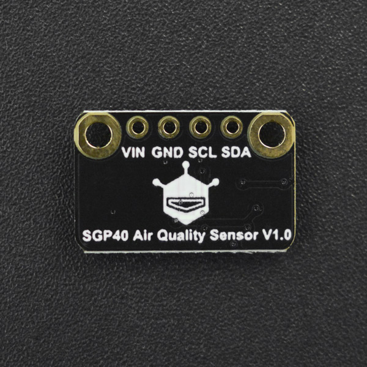

# DFRobot_SGP40
- [English Version](./README.md)

SGP40空气质量传感器采用知名品牌Sensirion推出的新款SGP40数字VOC传感器芯片。基于Sensirion公司的CMOSens®技术，SGP40提供了一个完整的单芯片传感器系统，一个温控微热板和湿度补偿室内空气质量信号。结合Sensirion强大的VOC算法，传感器信号可以直接用于评价室内空气质量。低功耗(2.6mA)，响应速度快(2s)。来自传感器的数据可以直接用于评价空气质量，而无需校准。




## 产品链接 (https://www.dfrobot.com.cn/goods-3062.html)

    SKU:SEN0392

## 目录

* [概述](#概述)
* [库安装](#库安装)
* [方法](#方法)
* [兼容性](#兼容性)
* [历史](#历史)
* [创作者](#创作者)

## 概述

1. 设置环境温度和湿度，便于准确校准。相对湿度单位:%RH，量程:0-100;温度单位:°C，范围:-10~50
2. 读取VOC指数，范围0-500

## 库安装

要使用这个库，首先将库下载到Raspberry Pi，然后打开例程文件夹。要执行一个例程demox.py，请在命令行中输入python demox.py。例如，要执行get_raw_value.py例程，你需要输入:
```
python get_raw_value.py
```
## 方法

```Python
    '''
      @brief start equipment
      @param duration:int Set to Warm-up time
      @return equipment condition. 0: succeed  1: failed 
    '''
    begin(self,duration = 10)

    '''
      @brief Set temperature and humidity
      @param relative_humidity:float Set to relative_humidity
      @param temperature_c:float Set to temperature
    '''
    set_envparams(relative_humidity,temperature_c)

    '''
      @brief Get raw data
      @param duration:int Set to Warm-up time
      @return collect result. (-1 collect failed)  (>0 the collection value)
    '''
    measure_raw(self)

    '''
      @brief Measure VOC index after humidity compensation
      @n VOC index can indicate the quality of the air directly. The larger the value, the worse the air quality.
      @n   0-100,no need to ventilate, purify
      @n   100-200,no need to ventilate, purify
      @n   200-400,ventilate, purify
      @n   00-500,ventilate, purify intensely
      @param duration:int Set to Warm-up time
      @return The VOC index measured, ranged from 0 to 500
    '''
    get_voc_index(self)
```

## 兼容性

* RaspberryPi Version

| Board        | Work Well | Work Wrong | Untested | Remarks |
| ------------ | :-------: | :--------: | :------: | ------- |
| RaspberryPi2 |           |            |    √     |         |
| RaspberryPi3 |           |            |    √     |         |
| RaspberryPi4 |     √     |            |          |         |

* Python 版本

| Python  | Work Well | Work Wrong | Untested | Remarks |
| ------- | :-------: | :--------: | :------: | ------- |
| Python2 |     √     |            |          |         |
| Python3 |     √     |            |          |         |


## 历史

- 日期 2021-9-26
- 版本 V1.0.0


## 创作者

Written by yangfeng(feng.yang@dfrobot.com), 2021. (Welcome to our [website](https://www.dfrobot.com/))

