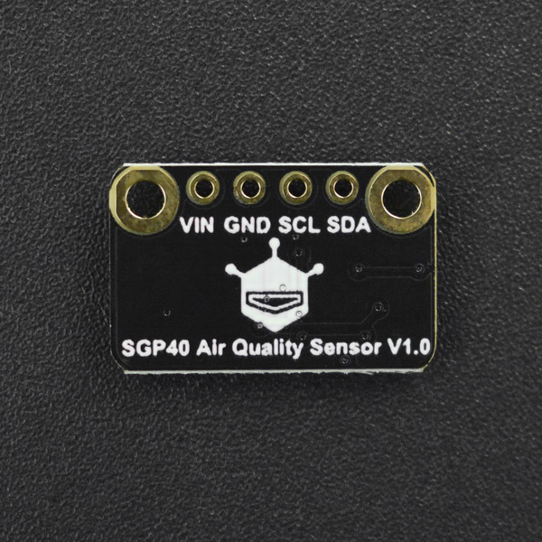

# DFRobot_SGP40
- [English Version](./README.md)

SGP40空气质量传感器采用知名品牌Sensirion推出的新款SGP40数字VOC传感器芯片。基于Sensirion公司的CMOSens®技术，SGP40提供了一个完整的单芯片传感器系统，一个温控微热板和湿度补偿室内空气质量信号。结合Sensirion强大的VOC算法，传感器信号可以直接用于评价室内空气质量。低功耗(2.6mA)，响应速度快(2s)。来自传感器的数据可以直接用于评价空气质量，而无需校准。



## 产品链接(https://www.dfrobot.com.cn/goods-3062.html)

    SKU：SEN0392

## 目录

* [概述](#概述)
* [库安装](#库安装)
* [方法](#方法)
* [兼容性](#兼容性)
* [历史](#历史)
* [创作者](#创作者)

## 概述

XYZ三刺激和红外数据的检测

## 库安装

使用此库前，请首先下载库文件，将其粘贴到\Arduino\libraries目录中，然后打开examples文件夹并在该文件夹中运行演示。

## 方法

```C++
  /**
   * @brief  初始化函数
   * @return 成功返回 true;失败返回false.
   */
  bool begin(uint32_t duration = 10000);
  
  /**
   * @brief  设置温湿度 
   * @param  relativeHumidityRH  当前环境湿度, 范围 0-100, 单位: %RH
   * @param  temperatureC  当前环境温度, 范围 -10~50, 单位: °C
   */
  void setRhT(float relativeHumidity = 50,float temperatureC=25);
  
  /**
   * @brief 测量湿度补偿后的VOC指数
   * @note VOC指数可以直接指示空气质量。值越大，空气质量越差。
   * @note 0-100，无需通风、净化
   * @note 100-200，无需通风、净化
   * @note 200-400，通风、净化
   * @note 400-500，通风，强烈净化
   * @return 测量的VOC指数，范围从0到500
   */
  uint16_t getVoclndex(void);

```

## 兼容性

| 主板          | 通过 | 未通过 | 未测试 | 备注 |
| ------------- | :--: | :----: | :----: | ---- |
| Arduino uno   |  √   |        |        |      |
| Mega2560      |  √   |        |        |      |
| Leonardo      |  √   |        |        |      |
| ESP32         |  √   |        |        |      |
| micro:bit     |  √   |        |        |      |
| FireBeetle M0 |  √   |        |        |      |


## 历史

- 日期 2021-9-26
- 版本 V1.0.0


## 创作者

Written by yangfeng(feng.yang@dfrobot.com), 2021. (Welcome to our [website](https://www.dfrobot.com/))

